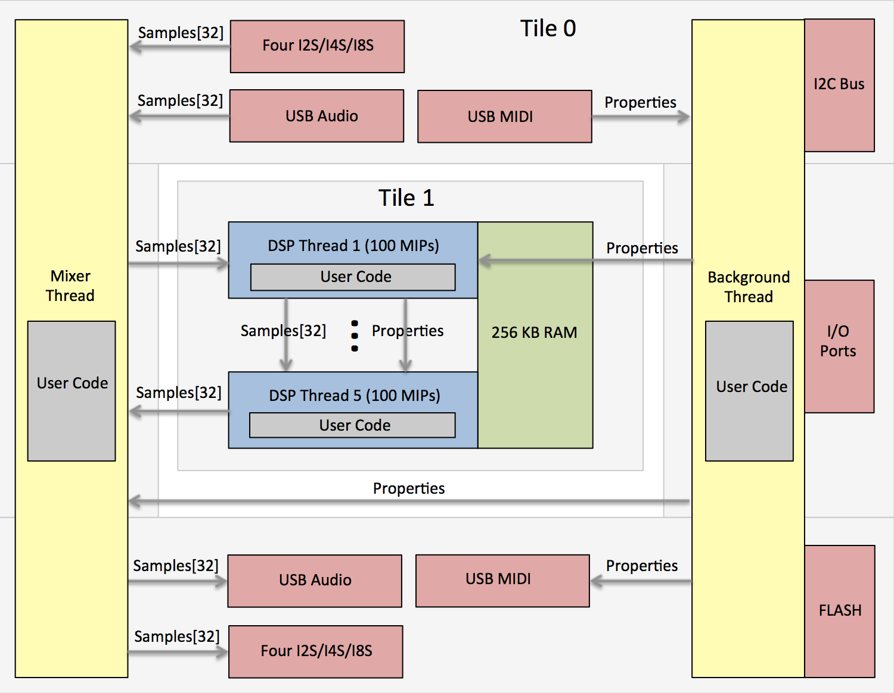

https://www.kickstarter.com/projects/689850781/flexfxtm-programmable-digital-audio-effects-platfo

FlexFX&trade;
==================================

FlexFX supports USB Audio and MIDI, 32/64-bit DSP, up to 32 audio channels, 48 to 384 kHz sampling rates, input to output latency of 350 microseconds. Devices can be updated with pre-built effects or custom designed effects at any time using standard USB/MIDI. No apps purchases, download costs, or user accounts are needed to load FlexFX pre-built effects to to develop your own custom applications/effects.

**Customization**  
FlexFX development Kit:  https://github.com/flexfx/flexfx.github.io
Compiler and Linker:     xTIMEcomposer (current version for FlexFX is 14.3.3) is available from www.xmos.com  

**Support**  
FlexFX user's forum:     https://flexfx.discussion.community  
XMOS xCORE Forum:        https://www.xcore.com  

Introduction
--------------------------------

The FlexFX&trade; provides a light framework for developing audio processing applications running on 3Degrees XIO USB/DSP modules.
The XIO modules and the FlexFX framework provides USB class 2.0 audio input and output, USB MIDI handling and routing,
up to four I2S/TDM interfaces (for multiple ADCs/DACs/CODECs - up to 32x32 input/output audio channels), and firmware
upgrades allowing audio application developers to focus on custom signal processing and run-time algorithm control.



* Very simple framework for writing custom audio processing applications
* Up to 500 MIPs available for signal processing algorithms (FlexFX module with XUF216)
* 32/64 bit fixed point DSP support, single-cycle instructions
* Up to 32x32 (48 kHz) channels of USB and I2S audio, up to 192 kHz audio sample rate at 8x8
* Single audio cycle DSP processing for all 32 channels (e.g. audio block size = 1)
* System latency (ADC I2S to DSP to DAC I2S) of 16 audio cycles (16/Fs). 
* USB interface for USB audio streaming ad USB MIDI for effects control and firmware updating
* Functions for I2C bus (for peripheral control) and port input/output
* I2S supports up to 8-slot TDM and up to four separate ADCs and four separate DACs

Getting Started
--------------------------------

1) Download and install the free XMOS development tools from www.xmos.com.

2) Obtain the FlexFX™ dev-kit for building your own apps from “https://github.com/markseel/flexfxkit”.    
     Download the ZIP file or use GIT …
```
git clone https://github.com/flexfx/flexfx.github.io.git
```

3) Set environment variables for using XMOS command-line build tools …
```
Windows         c:\Program Files (x86)\XMOS\xTIMEcomposer\Community_14.3.3\SetEnv.bat
OS X or Linux   /Applications/XMOS_xTIMEcomposer_Community_14.3.3/SetEnv.command
```

4) Add your own source code to a new 'C' file (e.g. ‘application.c’).

5) Build the application …
```
xcc -report -O3 -lquadflash xio.xn xio.a flexfx.c your_app.c -o your_app.xe
```

6) Burn your firmware application directly to FLASH using the XMOS JTAG (XTAG-2 or XTAG3) adapter or create a binary image for loading via USB/MIDI using the XIO firwmare upgrade-via-midi protocol.  The Python script 'xio.py' and the HTML file
'c99.html' (using Google Chrome) both support MIDI over USB firmware updating. Run the python script with no arguments to see the available script run-time options (e.g. "python xio.py").
```
xflash --no-compression --factory-version 14.3 —-upgrade 1 your_app.xe
 — or —
xflash --no-compression --factory-version 14.3 --upgrade 1 your_app.xe -o your_app.bin
python xio.py 0 your_app.bin
```

7) A FlexFX system can be firmware upgraded using USB/MIDI.  But if that fails due to misbehaving custom programs or FLASH data corruption you can to revert your system back to its original/factory condition.  Use the JTAG device (XMOS XTAG2 or XTAG3) to load the factory XIO firmware into the factory and upgrade portions of the FLASH boot partition ...
```
xflash --boot-partition-size 1044480 --no-compression --factory bin/xio.xe --upgrade 1 bin/xio.xe
```

You can create custom audio processing effects by downloading the FlexFX&trade; audio processing framework, adding custom audio processing DSP code and property handling code, and then compiling and linking using XMOS tools (xTIMEcomposer, free to download).
The custom firmware can then be burned to FLASH using xTIMEcomposer and the XTAG-2 or XTAG-3 JTAG board ($20 from Digikey) or via USB/MIDI.

FlexFX&trade; implements the USB class 2.0 audio and USB MIDI interfaces, the I2S/CODEC interface, sample data transfer from USB/I2S/DSP threads, property/parameter routing, and firmware upgrading. FlexFX provides functions for peripheral control (GPIO's and I2C), FLASH memory access, fixed point scalar adn vector math, and a wide range of DSP functions.

All you have to do is add DSP code and any relevant custom property handling code to the five audio processing threads which all run in parallel and implement a 5-stage audio processing pipeline.
Each processing thread is allocated approximately 100 MIPS and executes once per audio cycle.
All threads are executed once per audio cycle and therefore operate on USB and I2S sample data one audio frame at a time.

Programming Interface
-----------------------------------------

The 'xio.h' file defines the application interface for USB/I2S audio and MIDI applications.

```C
#ifndef INCLUDED_XIO_H
#define INCLUDED_XIO_H

// FQ converts Q28 fixed-point to floating point
// QF converts floating-point to Q28 fixed-point

#define QQ 28
#define FQ(hh) (((hh)<0.0)?((int)((double)(1u<<QQ)*(hh)-0.5)):((int)(((double)(1u<<QQ)-1)*(hh)+0.5)))
#define QF(xx) (((int)(xx)<0)?((double)(int)(xx))/(1u<<QQ):((double)(xx))/((1u<<QQ)-1))

typedef unsigned char byte;
typedef unsigned int  bool;

// Functions and variables to be implemented by the application ...

extern const char* product_name_string;   // Your product name
extern const char* usb_audio_output_name; // Your USB audio output name
extern const char* usb_audio_input_name;  // Your USB audio input name
extern const char* usb_midi_output_name;  // Your USB MIDI output name
extern const char* usb_midi_input_name;   // Your USB MIDI input name

extern const int audio_sample_rate;       // Audio sampling frequency (48K,96K,192K,or 384K)
const int audio_clock_mode                // 0=internal/master,1=external/master,2=slave
extern const int usb_output_chan_count;   // 2 USB audio output channels (32 max)
extern const int usb_input_chan_count;    // 2 USB audio input channels (32 max)
extern const int i2s_channel_count;       // 2,4,or8 I2S channels per SDIN/SDOUT wire

extern const int i2s_sync_word[8];        // I2S WCLK words for each slot

// The startup task is called before the control and mixer tasks and should be used to initizlize
// control data and variables.

extern void xio_startup( void );

// The control task is called at a rate of 1000 Hz and should be used to implement audio CODEC
// initialization/control, pot and switch sensing via I2C ADC's, handling of properties from USB
// MIDI, and generation of properties to be consumed by the USB MIDI host and by the DSP threads.
// The incoming USB property 'rcv_prop' is valid if its ID is non-zero and an outgoing USB
// property, as a response to the incoming property, will be sent out if's ID is non-zero. DSP
// propertys can be sent to DSP threads (by setting the DSP property ID to zero) at any time.
// It's OK to use floating point calculations here as this thread is not a real-time audio thread.

extern void xio_control( const int rcv_prop[6], int snd_prop[6], int dsp_prop[6] );

// The mixer function is called once per audio sample and is used to route USB, I2S and DSP samples.
// This function should only be used to route samples and for very basic DSP processing - not for
// substantial sample processing since this may starve the I2S audio driver. Do not use floating
// point operations since this is a real-time audio thread - all DSP operations and calculations
// should be performed using fixed-point math.
// NOTE: IIR, FIR, and BiQuad coeff and state data *must* be declared non-static global!

extern void xio_mixer( const int usb_output[32], int usb_input[32],
                       const int i2s_output[32], int i2s_input[32],
                       const int dsp_output[32], int dsp_input[32], const int property[6] );

// Audio Processing Threads. These functions run on tile 1 and are called once for each audio sample
// cycle. They cannot share data with the controller task or the mixer functions above that run on
// tile 0. The number of incoming and outgoing samples in the 'samples' array is set by the constant
// 'dsp_chan_count' defined above. Do not use floating point operations since these are real-time
// audio threads - all DSP operations and calculations should be performed using fixed-point math.
// NOTE: IIR, FIR, and BiQuad coeff and state data *must* be declared non-static global!

// Process samples and properties from the app_mixer function. Send results to stage 2.
extern void xio_thread1( int samples[32], const int property[6] );
// Process samples and properties from stage 1. Send results to stage 3.
extern void xio_thread2( int samples[32], const int property[6] );
// Process samples and properties from stage 2. Send results to stage 4.
extern void xio_thread3( int samples[32], const int property[6] );
// Process samples and properties from stage 3. Send results to stage 5.
extern void xio_thread4( int samples[32], const int property[6] );
// Process samples and properties from stage 4. Send results to the app_mixer function.
extern void xio_thread5( int samples[32], const int property[6] );

// On-board FLASH read write functions.

void flash_read ( int page, byte data[256] );
void flash_write( int page, const byte data[256] );

unsigned timer_count( void );
void timer_delay( int microseconds );

// Functions for peripheral control (*** do not use these in real-time DSP threads ***).

void i2c_start( int speed );  // Set bit rate (bps), assert an I2C start condition.
byte i2c_write( byte value ); // Write 8-bit data value.
byte i2c_read ( void );       // Read 8-bit data value.
void i2c_ack  ( byte ack );   // Assert the ACK/NACK bit after a read.
void i2c_stop ( void );       // Assert an I2C stop condition.

void spi_config  ( int speed );  // Set the SPI bit rate (bps).
void spi_select  ( byte csel );  // Assert (csel==1) or de-select (csel==0) the chip select.
byte spi_transfer( byte value ); // Write and read the next byte.

void port_put( int mask, int value ); // Write 0 or 1 to ports/pins indicated by 'mask' where ...
void port_set( int mask );            // ... each mask bit set to 1 specifies an action on that port ...
void port_clr( int mask );            // ... and where mask bit pos 0 is port 0, pos 1 is port 1, etc.
byte port_get( int mask );            // Read ports indicated by 'mask', set to HiZ state.

#endif
```

Minimal Application
-----------------------------------------

The application programmer only needs to add control and audip processing code to create a complete application.  The code below is a complete application.  Just add code to the 'xio\_startup', 'xio\_control', 'xio\_mixer', and the 'xio\_threadN' functions.

```C
#include "xio.h"
#include "dsp.i"
#include "dsp.h"

const char* product_name_string   = "Example";           // The product name
const char* usb_audio_output_name = "Example Audio Out"; // USB audio output name
const char* usb_audio_input_name  = "Example Audio In";  // USB audio input name
const char* usb_midi_output_name  = "Example MIDI Out";  // USB MIDI output name
const char* usb_midi_input_name   = "Example MIDI In";   // USB MIDI input name

const int audio_sample_rate     = 192000; // Default sample rate at boot-up
const int audio_clock_mode      = 0; // 0=internal/master,1=external/master,2=slave
const int usb_output_chan_count = 2;     // 2 USB audio class 2.0 output channels
const int usb_input_chan_count  = 2;     // 2 USB audio class 2.0 input channels
const int i2s_channel_count     = 2;     // ADC/DAC channels per SDIN/SDOUT wire (2,4,or 8)

const int i2s_sync_word[8] = { 0xFFFFFFFF,0x00000000,0,0,0,0,0,0 }; // I2S WCLK values per slot

void xio_startup( void ) {}
void xio_control( const int rcv_prop[6], int usb_prop[6], int dsp_prop[6] ) {}

void xio_mixer( const int usb_output[32], int usb_input[32],
                const int adc_output[32], int dac_input[32],
                const int dsp_output[32], int dsp_input[32], const int property[6] ) {}

void xio_initialize( void ) {}

void xio_thread1( int samples[32], const int property[6] ) {}
void xio_thread2( int samples[32], const int property[6] ) {}
void xio_thread3( int samples[32], const int property[6] ) {}
void xio_thread4( int samples[32], const int property[6] ) {}
void xio_thread5( int samples[32], const int property[6] ) {}
```

FlexFX Properties
----------------------------------

FlexFX applications can be controlled using FlexFX property exchanges over USB MIDI.
A property is composed of a 24-bit device identifier, a non-zero 8-bit ID and five 32-bit data words.

An example property is shown below:

```
Device ID   = 0x000000     (0x000000 indicates that the device ID is ignored)
Property ID = 0x12         (must be non-zero)
Param 1     = 0x11223344   (a value of 0xFFFFFFFF is not allowed)
Param 2     = 0x55667788   (a value of 0xFFFFFFFF is not allowed)
Param 3     = 0x99aabbcc   (a value of 0xFFFFFFFF is not allowed)
Param 4     = 0x01234567   (a value of 0xFFFFFFFF is not allowed)
Param 5     = 0x89abcdef   (a value of 0xFFFFFFFF is not allowed)
```

FlexFX properties are transfered via over USB/MIDI using MIDI SYSEX messages.
The FlexFX framework handles parsing and rendering of MIDI SYSEX encapulated FlexFX data therefore the user
application need not deal with MIDi SYSEX - the audio firmware only sees 16-bit ID and five 32-word property values.

```
ID     DIRECTION            DESCRIPTION

0x01   USB Bidirectional    Identify the device, return ID (3DEGFLEX) and version numbers
0x02   USB Bidirectional    Begin firmware upgrade, echoed back to host
0x03   USB Bidirectional    Next 32 bytes of firmware image data, echoed
0x04   USB Host to Device   End firmware upgrade and reset (no USB property echo!)
0x05   Device to USB Host   Report the footswitch state and up to four knob positions
0x05   Device to UART       Broadcast the footswitch state and up to four knob positions
       UART to Device       Update/set the footswitch state and up to four knob positions
       USB Bidirectional    Return four knob positions and footswitch state
0x06   USB Bidirectional    Read or write 20 parameters (0 for read, 1..99 to write) for preset #1
0x07   USB Bidirectional    Read or write 20 parameters (0 for read, 1..99 to write) for preset #2
0x08   USB Bidirectional    Read or write 20 parameters (0 for read, 1..99 to write) for preset #3
0x09   USB Bidirectional    Read or write 20 parameters (0 for read, 1..99 to write) for preset #4
0x0A   USB Bidirectional    Read or write 20 parameters (0 for read, 1..99 to write) for preset #5
```

#### FlexFX ID = 0x01: Identify; return ID (3DEGFLEX) and versions

```
USB host ---> [ 0x01,    0,    0,    0,       x, y ]
USB host <--- [ 0x01, 3DEG, FLEX, serial_num, x, y ]
```
The USB host can use this property to solicit information about that attached device and determine whether or not it is a FlexFX device.  The device will return the flexfx signature word, the serial number, and will echo property words #4 and #5.

#### FlexFX ID = 0x02: Begin firmware upgrade

```
USB host ---> [ 0x02, 0, 0, 0, 0, 0 ]
USB host <--- [ 0x02, 0, 0, 0, 0, 0 ]
```
Open the FLASH device and erase it to begin the firmware upgrade process.

#### FlexFX ID = 0x03: Continue firmware upgrade

```
USB host ---> [ 0x03, data1, data2, data3, data4, data5 ]
USB host <--- [ 0x03, data1, data2, data3, data4, data5 ]
```
Write the next 40 bytes of firmware data to FLASH.

#### FlexFX ID = 0x04: End firmware upgrade

```
USB host ---> [ 0x04, 0, 0, 0, 0, 0 ]
USB host <--- [ 0x04, 0, 0, 0, 0, 0 ]
```
Close thge FLASH device and reboot to end the firmware upgrade process.

#### FlexFX ID = 0x05: Report, broadcast, or accept the footswitch state and up to four knob positions

```
USB host  <--- [ 0x05, fswitch, knob1, knob2, knob3, knob4 ]
Serial TX <--- [ 0x05, fswitch, knob1, knob2, knob3, knob4 ]
Serial RX ---> [ 0x05, fswitch, knob1, knob2, knob3, knob4 ]

```

#### FlexFX ID = 0x06-0x0A Read and write preset parameter values for presets 1 through 5

```
USB host ---> [ 0x06-0x0A, values[1:4], values[5:8], values[9:12], values[13:16], values[17:20] ]
USB host <--- [ 0x06-0x0A, values[1:4], values[5:8], values[9:12], values[13:16], values[17:20] ]

where 1 <= value <= 99 for writing/reading, value == 0 for reading
```

Returns and potentially updates all parameter values for preset P.  There are 20 paramter values for each of the five presets.  Each parameter value ranges from 1 to 99.  Parameter values of zero are not written to the device - use this behavior for performing read-only operations.

Prebuilt Effects
----------------------------------

The FlexFX kit contains highly optimized effects for delay, overdrive, equalization, reverb, and cabinet simulation as part of the FlexFX C99 project. These effects are in source and binary (\*.bin) form and can be used for free on FlexFX boards.  All effects support full control over each effect's presets and parameter settings via FlexFX properties sent and received over USB/MIDI using the 'xio.py' script, 'c99.html' Google Chrome HTML interface, or any other
application programmed to use USB/MIDI for FlexFX property data transfer.

**Amplifier/Cabinit Simulation**
Amp and cabinet simulation using impulse responses. A tube amplifier model and tone stack followed by up to 40 milliseconds of impulse response processing. Effect parameters for amplifier drive, bass boost/cut and center frequency, midrange boost/cut and center frequency, treble boost/cut and center frequency, power supply sag, output volume, and cabinet impulse response selection. Up to five presets.

**Tube Preamp/Overdrive**
Three-stage tube preamp overdrive model with customizable preamp responses and dynamics per preamp stage. Internal DSP processing at 12x oversampling (i.e. at 576 kHz) using 32/64 bit math functions.  Effect parameters for input drive, pre-stage bass cut, post-stage treble cut, slew-rate limiting, stage gain, triode/tube bias points, and output volume. Up to five presets.

**Delay/Chorus/Flanger**
Combination delay/chorus/flanger supporting variable LFO frequency, variable delay, feedback adjustment, tone filtering, and wet/dry blending. Parameters for input drive, delay time, LFO rate, modulation depth, parametric filter frequency and Q-factor, wet signal diffusion, feedback level, wet/dry mix and output volume. Up to five presets.

**Graphic Equalizer**
15-band graphic equalizer with -12dB cut to +12dB boost per band. Up to five presets for EQ band cut/boost levels and output volume.

Stackable Expansion Boards
----------------------------------

All FlexFX exansion boards stack directly above or below the FlexFX USB/DSP board allowing for a very compact system.
The PCB board design files are freely available. Fully assembled and tested boards are also available from Tindie (comming soon).


**Guitar Effects Interface**
Ultra low noise buffered guitar interface and mono line-level output using the AK4621 differentialin/out stereo CODEC. Fully
differential analog signaling between the input buffers / output drivers and the CODEC.  Also has three additional low noise analog inputs for potentiometers and WAH pedals.

**8x8 Analog Input//Output**
8x8 analog interface using four AK4556 24-bit CODECs. Has 8 inputs and 8 outputs all with DC coupling (CODECs are configured to disable the HPF so that low frequency or DC signals can be sensed) this could be used for synth projects or effects where you want the parameter controls to used in real time.

**Headphone Amplifier**
Low distortion and low noise headphone amplifier with all DC coupling (AK4482 DAC outputs to headphone jack). Four low-noise buffers (two per differential DAC output) driving 2nd order RLC low pass filters (to filter out DAC sigma-delta conversion noise) and two dual high current OPA's (one AD8397 per channel for virtual ground, DC shift, and headphone driver). Response is +/-1dB to 170kHz with less than 6 degrees or phase shift at 20kHz. Filters have -70dB attenuation at 6.144 Mhz (frequency of sigma-delta).  Performance: ~0.0003% THD at 10kHz and ~0.00003 at 1kHz while driving 32 ohm headphones at 1 Vrms (2.8 volts pk-pk).

**Power Adapter/Selector/ADC**
Power adpator board for powering a FlexFX system from 9V. Can auto-detect between the 9V power source and USB power for glitch-free power when changing 9V/USB power sources. Also has an eight-channel low-speed ADC for connecting additional potentiometers for effects applications requireing many knobs/controls.

